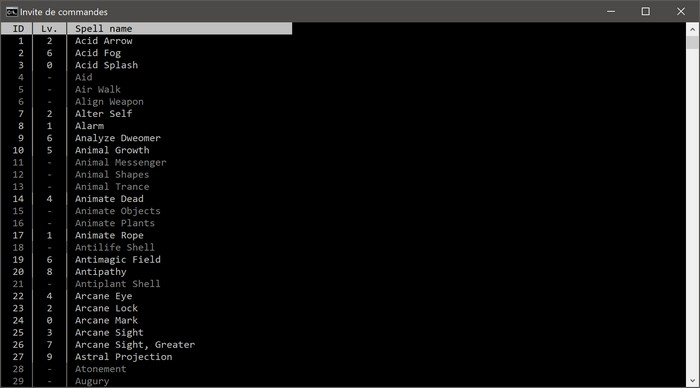
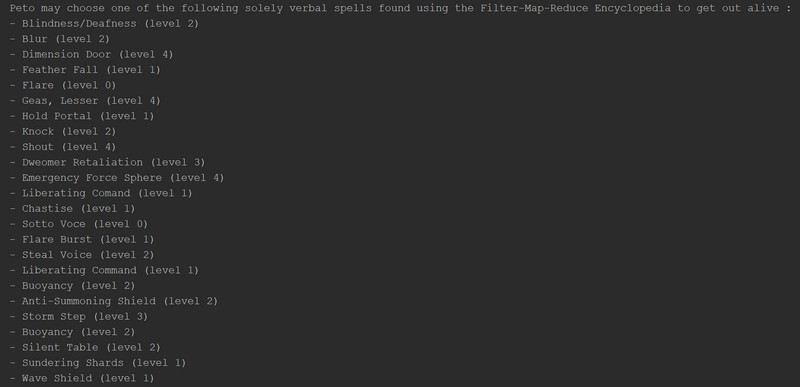
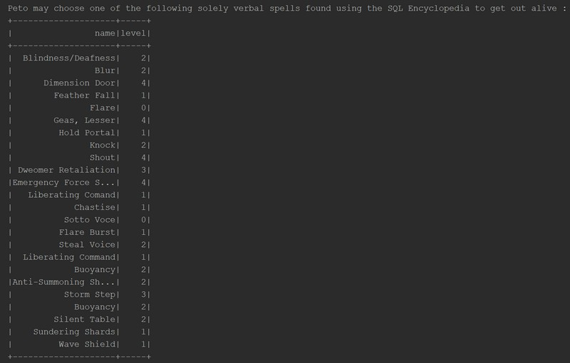
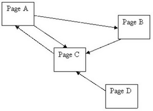
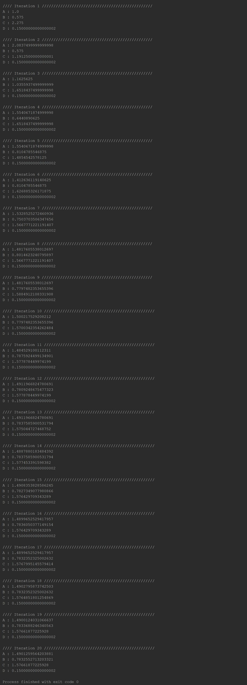

# Bases de données réparties / Devoir n°1

Membres du groupe : Simon Lecoq

## Exercice 1 ([src/main/scala/Exercise1.scala](src/main/scala/Exercise1.scala))

### Réalisation d'un crawler ([src/main/crawler/index.js](src/main/crawler/index.js))

Le crawler a été réalisé en NodeJS à l'aide de la bibliothèque [X-ray](https://github.com/matthewmueller/x-ray) ainsi que quelques Regex.
Celui-ci permet de parser les données des sorts récupérées à partir de [dxcontent](http://www.dxcontent.com/), puis de les stocker au format *json* dans le fichier [`src/main/resources/spells.json`](https://github.com/lowlighter/dd1/blob/master/src/main/resources/spells.json).

Le crawler est configuré pour récupérer la totalité des sorts listés sur le site en faisant varier le paramètre GET `SDBID`. Il s'arrête de fonctionner lorsque le site ne trouve plus de sort correspondant dans sa base de données. Pour éviter de faire crash le site, seule une requête à la fois est envoyée.

Pour faire fonctionner le crawler, il faut : 

0. Avoir NodeJS d'installé et une connexion internet 
1. Se rendre dans le dossier `src/main/crawler`
2. Effectuer un `npm install`
3. Lancer un `node index.js`
4. Laisser la magie opérer

*NB : La sortie est un tableau d'objets, ce qui signifie qu'il faille attendre que le crawler est terminé pour que la sortie soit valide. En cas d'interruption avec un Ctrl-C, il faudra rajouter manuellement la fermeture du tableau.*



Voici un exemple de la structure de données en sortie du crawler.
Ici le `level` du sort est un nombre si le sort peut être lancé par un *sorcerer* ou un *wizard* et vaut `null` le cas échéant (il s'agit des sorts grisés sur l'image du dessus).
```json
{
  "name": "Acid Arrow",
  "description": "An arrow of acid springs from your hand and speeds to its target. You must succeed on a ranged touch attack to hit your target. The arrow deals 2d4 points of acid damage with no splash damage. For every three caster levels you possess, the acid, unless neutralized, lasts for another round (to a maximum of 6 additional rounds at 18th level), dealing another 2d4 points of damage in each round.",
  "id": 1,
  "school": "conjuration (creation) [acid]",
  "level": 2,
  "casting_time": "1 standard action",
  "components": [
    "V",
    "S",
    "M (rhubarb leaf and an adder&apos;s stomach)",
    "F (a dart)"
  ],
  "range": "long (400 ft. + 40 ft./level)",
  "effect": "one arrow of acid",
  "duration": "1 round + 1 round per three levels",
  "saving_throw": "none",
  "spell_resistance": false
}
```

### Recherche des sorts utilisables

Les sorts que Peto peut utiliser (niveau ≤ 4 et composante verbale uniquement) sont récupérés de deux façons différentes.

#### Méthode 1 : RDD et filtres ([src/main/scala/Exercise1.scala#L19-L25](src/main/scala/Exercise1.scala#L19-L25))

Le fichier *json* récupéré par le crawler est converti en rdd, puis la méthode `filter` est appliquée afin de filtrer les sorts correspondants.

```scala
spells.rdd
  .filter(row => 
    (row.getAs[Any]("level") != null) //Le sort peut être lancé par un *sorcerer* ou un *wizard*
    && (row.getAs[Long]("level") <= 4) //Le sort est de niveau ≤ 4
    && row.getAs[Seq[String]]("components").contains("V") //Le sort possède une composante verbale
    && (row.getAs[Seq[String]]("components").length == 1) //Le sort ne possède aucune autre composante
  )
```

Chaque valeur restante est ensuite formattée en string puis affichée à l'écran.



#### Méthode 2 : DataFrame et SQL ([src/main/scala/Exercise1.scala#L27-L34](src/main/scala/Exercise1.scala#L27-L34))

Le fichier *json* récupéré par le crawler est converti en une DataFrame qui peut être lu par un `sqlContext` auquel on effectue une requête SQL pour récupérer les sorts correspondants.

```scala
spark.sqlContext
  .sql("SELECT name, level FROM spells " + 
    "WHERE (level IS NOT NULL) " + //Le sort peut être lancé par un *sorcerer* ou un *wizard*
    "AND (level <= 4) " + //Le sort est de niveau ≤ 4
    "AND (ARRAY_CONTAINS(components, 'V')) " + //Le sort possède une composante verbale
    "AND (CARDINALITY(components) == 1)" //Le sort ne possède aucune autre composante
  )
```

Chaque valeur est ensuite affichée à l'écran.



## Exercice 2 ([src/main/scala/Exercise2.scala](src/main/scala/Exercise2.scala))

On implémente ici l'algorithme du [PageRank](https://fr.wikipedia.org/wiki/PageRank) en scala avec Spark.
L'objectif est de l'exécuter sur le graphe suivant :



### Initialisation 

On commence par créer un `RDD<Key, Value>` représentant ce graphe :
```scala
var pages = spark.sparkContext.makeRDD(Array(
  ("A", new Page("A", Array("B", "C"))),
  ("B", new Page("B", Array("C"))),
  ("C", new Page("C", Array("A"))),
  ("D", new Page("D", Array("C")))
)).cache()
```
Avec la structure `Page` étant définie comme la suivante :
```scala
case class Page(url:String = "", links:Array[String] = Array(), var rank:Double = 1.0)
```

On initialise ensuite les paramètre du PageRank, à savoir le *Damping factor* et le nombre d'itérations à effectuer :
```scala
val d = 0.85
val n = 20
```

### Exécution

Après l'initialisation, on va itérer l'algorithme du PageRank `n` fois.
La boucle principale est composée des différentes parties détaillées ci-dessous.

1. Tout d'abord, la contribution de chaque page est calculée pour chacun de ses liens, puis réduit par une simple addition.
```scala
val ranks = pages
  .flatMap{case (_, page) => page.links.map(link => (link, page.rank / page.links.size))}
  .reduceByKey((a, b) => a + b)
```

2. Ensuite, les contributions calculées sont jointes avec les pages initiales, et la valeur des rangs de celles-ci sont mises à jour avec la formule `(1 - d) + d * rank`. 

```scala
pages = pages
  .leftOuterJoin(ranks)
  .mapValues{case (page, rank) => {
    page.rank = (1 - d) + d * rank.getOrElse(0.0)
    page
  }}
```

3. Enfin, les résultats de l'itération sont affichés à l'écran.
```scala
println(s"\n//// Iteration ${i} ////////////////////////////////////////////////")
pages.foreach(v => println(s"${v._1} : ${v._2.rank}"))
```

Finalement, la sortie est la suivante : 


