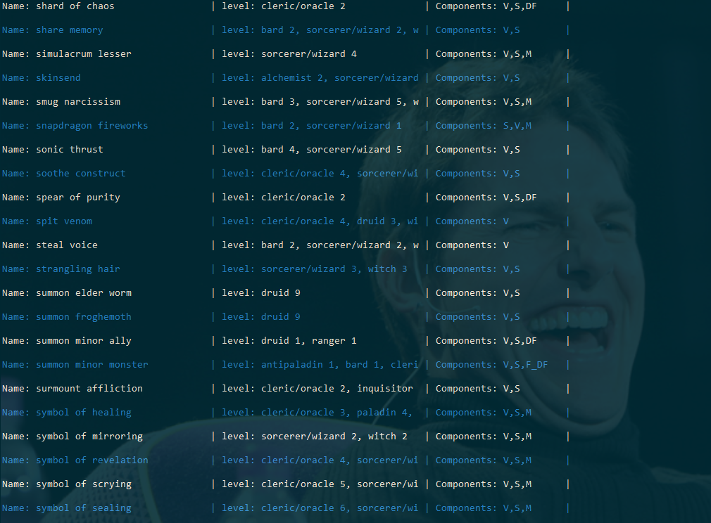
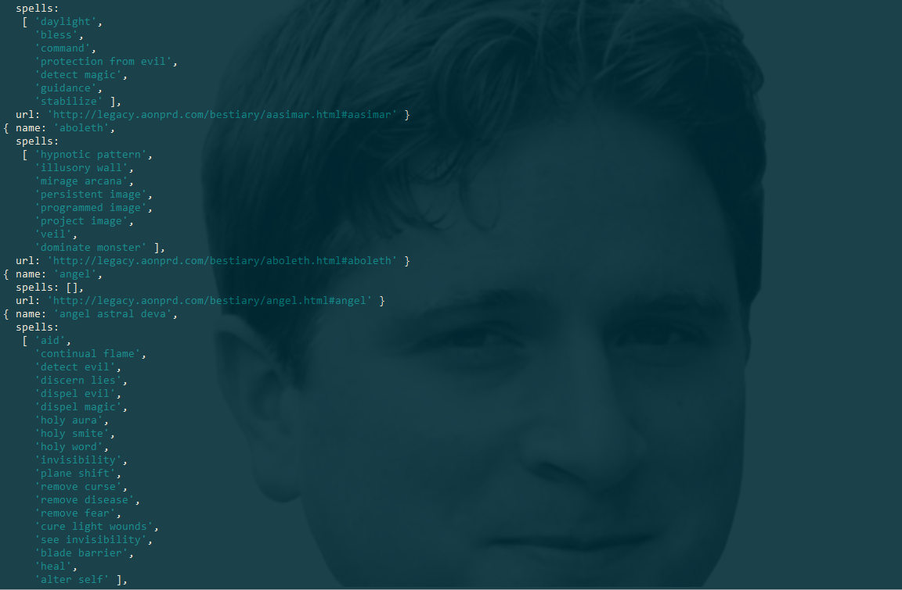
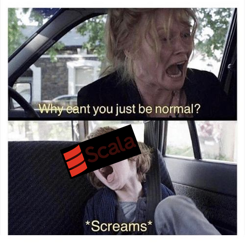
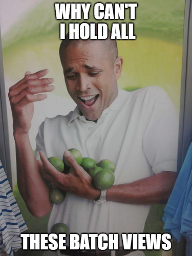
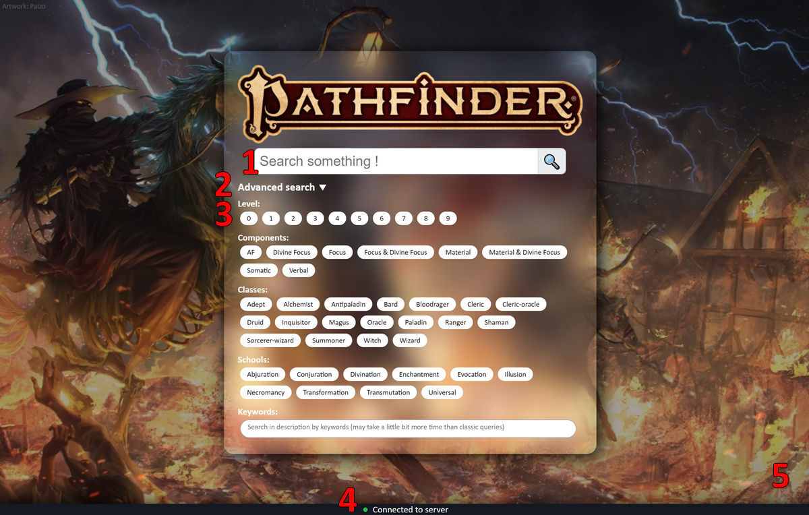
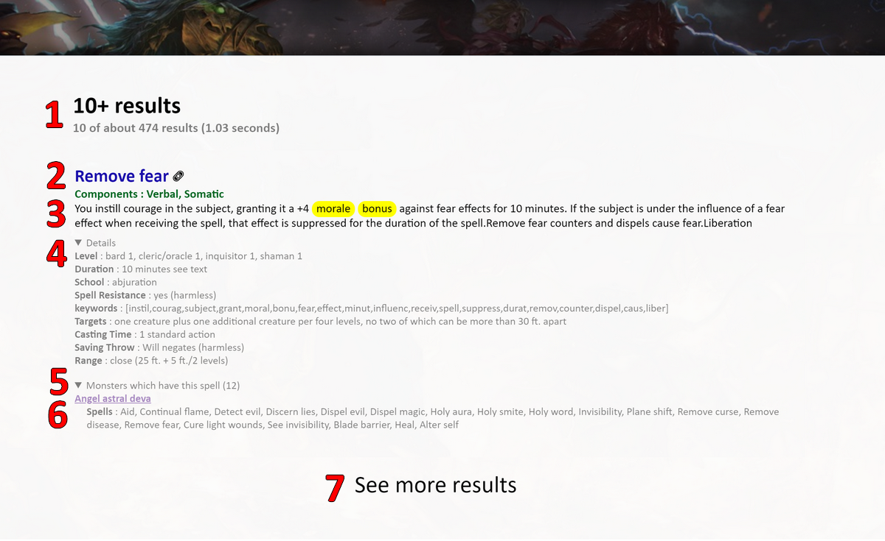
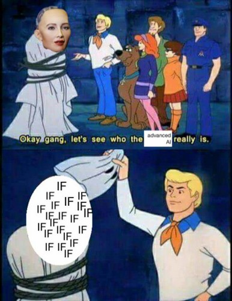
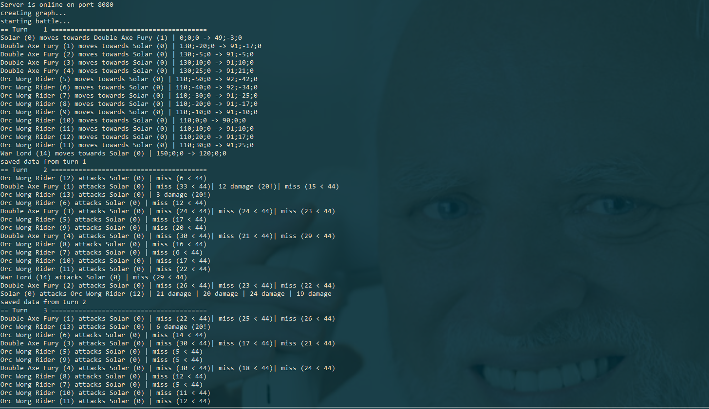

# TP n°2 Base de donnée reparties (Mirroir)
 
Ce TP a été réalisé par Simon Lecoq et Louis-Quentin Joucla dans le cadre du cours 8INF803 de l'université du Québec à Chicoutimi (UQAC).
 
___
 
# Crawler
 
Le premier objectif de ce TP est de créer un crawler récupérant les données du JdR Pathfinder™.
Le crawler a été réalisé sous NodeJS.
 
Comme pour le TP1, on va faire face à des sites très homogènes, ce sera donc un plaisir d'améliorer notre crawler.
Il n'y aura donc aucune utilité à gérer les [doubles](http://www.dxcontent.com/SDB_SpellBlock.asp?SDBID=925) [doublons](http://www.dxcontent.com/SDB_SpellBlock.asp?SDBID=1754), les [erreurs typographiques](http://www.dxcontent.com/SDB_SpellBlock.asp?SDBID=1701) dans les noms de classes, les [pages supprimées](http://www.dxcontent.com/SDB_SpellBlock.asp?SDBID=1841), ... En plus de devoir normaliser les noms de spells car on utilise deux sites, un pour les spells et un pour les monstres.
 
## Les spells
 
Pour construire les données de spells, nous avons mis à jour le [Prolocrawl™ v3.0](https://github.com/louisquentinjoucla/bddtp1), qui est passé à la [version 7.0](https://github.com/lowlighter/uqac/blob/master/database/2/mirror/src/crawler/crawler.js) ! Celui-ci inclut de nouvelles fonctionnalités, telles que la récupération automatisée d'urls informatiques, des caractéristiques et spécifités de chacun des spells, etc.
 
Voici par exemple le détail d'un spell généré par le Prolocrawl™ 7.0 :
```json
{
  "name": "alter self",
  "components": ["V", "S", "M"],
  "description": "When you cast this spell, you can assume the form of any Small or Medium creature of the humanoid type. If the form you assume has any of the following abilities, you gain the listed ability: darkvision 60 feet, low-light vision, scent, and swim 30 feet.Small creature: If the form you take is that of a Small humanoid, you gain a +2 size bonus to your Dexterity.Medium creature: If the form you take is that of a Medium humanoid, you gain a +2 size bonus to your Strength.",
  "keywords": ["cast", "spell", "assum", "form", "small", "medium", "creatur", "humanoid", "type", "follow", "abil", "gain", "list", "darkvis", "feet", "low", "light", "vision", "scent", "swim", "take", "size", "bonu", "dexter", "strength"],
  "url": "http://www.dxcontent.com/SDB_SpellBlock.asp?SDBID=7",
  "School": "transmutation (polymorph)",
  "Level": "bard 2, sorcerer/wizard 2, witch 2, summoner 2, alchemist 2, magus 2, shaman 2",
  "Casting Time": "1 standard action",
  "Range": "personal",
  "Targets": "you",
  "Duration": "1 min./level"
}
```
Les lecteurs aguéris remarqueront la présence d'un champ `"keywords"` (plus communément "clés-mots" en français).
Les ingénieurs de Prolocrawl™ 7.0 ont su copier des moteurs de recherches bancals dans le but de vous fournir une experience utilisateur **très**.
 
### Etape 1: Supprimer les stopwords
 
Les stopswords sont les mots inutiles de la langue anglaise sans lesquels il ne serait pas possible de former une phrase grammaticalement correcte.
Reprenons par exemple la description du spell ci-dessus auquel nous allons enlever les *stopwords*:
 
> *~~When you~~ cast ~~this~~ spell, ~~you can~~ assume ~~the~~ form ~~of any~~ Small ~~or~~ Medium creature ~~of the~~ humanoid type. ~~If the~~ form ~~you~~ assume ~~has any of the~~ following abilities, ~~you~~ gain ~~the~~ listed ability: darkvision ~~60~~ feet, low-light vision, scent, ~~and~~ swim ~~30~~ feet.Small creature: ~~If the~~ form ~~you~~ take ~~is that of a~~ Small humanoid, ~~you~~ gain ~~a +2~~ size bonus ~~to your~~ Dexterity. Medium creature: ~~If the~~ form ~~you~~ take ~~is that of a~~ Medium humanoid, ~~you~~ gain ~~a +2~~ size bonus ~~to your~~ Strength.*
 
On va ensuite normaliser le tout une nouvelle fois, en supprimant tous les caractères de ponctuation, les majuscules, etc.
Ce qui nous donne :
 
> *cast spell assume form small medium creature humanoid type form assume following abilities gain listed ability darkvision feet low light vision scent swim feet small creature form take small humanoid gain size bonus dexterity medium creature form take medium humanoid gain size bonus strength*
 
### Etape 2: Utiliser une bibliothèque trouvée sur le net pour obtenir les stems
 
Au delà de la recherche google épuisante, cela consiste à prendre uniquement la racine des mots, pour grouper les mots clés. Par exemple si on a:
 
> *loves love loving*
 
On obtient:
 
> *lov lov lov*
 
Si on l'applique à notre exemple de description, on obtient:
 
> *cast spell assum form small medium creatur humanoid type form assum follow abil gain list abil darkvis feet low light vision scent swim feet small creatur form take small humanoid gain size bonu dexter medium creatur form take medium humanoid gain size bonu strength*
 
Après avoir retiré les doublons, on obtient finalement le champ `"keywords"` tant convoité :
 
> *cast spell assum form small medium creatur humanoid type follow abil gain list darkvis feet low light vision scent swim take size bonu dexter strength*
 
### Etape 3: ???
 
Laissez la magie de Prolocrawl™ 7.0 opérer.
 
### Etape 4: Profit
 

 
Lien vers les fichiers JSON crawlés :
* [monsters.json](https://github.com/lowlighter/uqac/blob/master/database/2/mirror/src/resources/JSON/monsters.json)
* [spells.json](https://github.com/lowlighter/uqac/blob/master/database/2/mirror/src/resources/JSON/spells.json)
 

## Les monstres
 
Pour construire notre fabuleux bestiaire, nous avons parcouru les tréfonds de legacy.aonprd.com ([on remercie la communauté de l'avoir ramené à la vie](https://paizo.com/community/blog/v5748dyo6sg93?Big-PathfinderStarfinder-Reference-Document-News)) avec notre crawler pour obtenir des objets JSON contenant entre autre le nom, les sorts et l'url de chaque monstre.
 
Voici un exemple de monstre :
```json
{
  "name": "kelpie",
  "spells": [
      "beast shape iv",
      "alter self"
  ],
  "url": "http://legacy.aonprd.com/bestiary2/kelpie.html#kelpie"
}
```
 

 
 
Wow ! Nous venons enfin de finir la première question de l'introduction du devoir 2. En même temps, avec un enoncé de 26 pages...
 
# Exercice 1
 
Qu'on le veuille ou non, on va devoir utiliser Apache spark, et donc le scala (la légende raconte même que certains auraient réussi à installer pyspark sur leur machine, mais apparemment nous ne sommes pas les élus...). Le but de cet exercice est de créer un moteur de recherche pour les sorts du JdR Pathfinder™.
 

 
## La batch layer
 
Le but de cette section est de transformer nos données crawlées en batchviews afin de faire plus facilement et plus rapidement des requêtes par la suite.
 
| Type          | Nombre de batch |
| ----------    | --------------: |
| Nom (a-z)     | 26 + 1          |
| Composante    | 8*              |
| Classe        | 130*            |
| Niveau        | 10*             |
| Ecole         | 10*             |
| Mot-clés      | 1               |
| Index inversé | 1               |
 
*Ceci est le nombre actuel de batchs views générés par notre application. Celle-ci étant bien conçue et bien pensée, le nombre de batch views peut s'adapter automatiquement en fonction des données trouvées par le Prolocrawl™ 7.0.
 
### [Creation des batchs views](https://github.com/lowlighter/uqac/blob/master/database/2/mirror/src/main/scala/Exercise1/BatchLayer.scala#L29-L177)
 
Nous avons à notre dispositions deux fichiers JSON (les données crawlées). Spark va transformer pour nous les deux fichiers JSON en RDD, sur lequels nous allons effectuer des opérations élémentaires telles que map, flatMap, filter, groupbykey, etc.
Prenons un premier exemple, nous voulons créer un index inversé des monstres. Nous avons des données de la forme:
 
| Monstre       | Spells                                          |
| ----------    | --------------                                  |
| Solar         | detect evil, heal, dictum, prismatic spray, etc.|
| Planetar      | detect evil, heal, prismatic spray, etc.        |
| drake-rift    | slow                                            |
 
On aura une fois l'index inversé créé:
 
| Spell         | Monstres                                        |
| ----------    | --------------                                  |
| detect devil  | Solar, Planetar, etc.                           |
| heal          | Solar, Planetar, etc.                           |
| slow          | drake-rift, etc.                                |
 
Puis on sauvegardera ensuite la batchview en fichier texte, afin d'éviter de la recalculer à la prochaine exécution du serveur.
Voici le code correspondant pour générer cette batchview:
 
```scala
monsters.rdd
  .map(row => (row.getAs[String]("name"), row.getAs[Seq[String]]("spells")))
  .flatMap{case (monster, spells) => spells.map(spell => (spell, monster))}
  .groupByKey()
  .map{case (key, values) => (key, values.mkString("[", ";;", "]"))}
  .saveAsTextFile(s"src/resources/batchviews/spells/monsters")
```
 
Prenons un second exemple, cette fois-ci nous voulons créer des batch views comportant les spells par école. On aurait donc pour chaque école un fichier de ce type (par exemple necromancy):
 
| Spell           | School     |
| ----------      | ------     |
| eyebite         | necromancy |
| false life      | necromancy |
| finger of death | necromancy |
| gentle repose   | necromancy |
 
La première étape consiste à préparer les données des batchs views des school.
Une ligne du type `{name:"alter self", School:"transmutation (polymorph)"}` sera transformée en un tuple `(transmutation, alter self)`.
Une fois cette transformation effectuée sur chaque sort, on les regroupe par école.
 
```scala
//Préparation des batch views school (school, [...spell_name])
val spells_schools = spells.rdd
  .map(row => (row.getAs[String]("School").split(" ")(0).toLowerCase, row.getAs[String]("name")))
  .groupByKey()
```
 
Ensuite on va récolter ce nouveau rdd en tant que `Map[School -> List[Spells]]` et pour chaque clé du tableau (qui est une école), on va générer une nouvelle batchview contenant la liste des spells.
 
```scala
//Création des batch views school (spell_name, [school])
spells_schools.collectAsMap().keys.foreach{case school => {
  spells_schools
    .filter{case (key, values) => key == school}
    .flatMap{case (key, spells) => spells.map(spell => (spell, school))}
    .map{case (spell, school) => (spell, s"[${school}]")}
    .saveAsTextFile(s"src/resources/batchviews/spells/schools/${school}")
}}
```
 
L'ensemble des batchs views générées sont consultables dans le dossier [batchviews/spells](https://github.com/lowlighter/uqac/blob/master/database/2/mirror/src/resources/batchviews/spells)
 

 
 
## La serving layer
 
Cette couche va traiter les requêtes (transportées via des WebSockets) en utilisant les batch views. Cela va permettre de renvoyer efficacement une réponse à l'utilisateur.
Au lancement du serveur, celui-ci va charger les batchviews en mémoire et attendre les futures requêtes.
 
Les requêtes sont reçues au format json et ressemblent à ceci:
```js
{
  name:"my spell", //Filtre par nom
  advanced:false, //Indique s'il s'agit d'une requête "avancée"
  levels:[], //Filtres de niveaux
  components:[], //Filtres de composantes
  classes:[], //Filtres de classes
  schools:[], //Filtres d'école
  misc:"", //Filtre de description
  limit:10 //Nombre de résultats à afficher
}
```
 
### [Traitement des requêtes](hhttps://github.com/lowlighter/uqac/blob/master/database/2/mirror/src/main/scala/Exercise1/ServingLayer.scala#L23-L139)
 
Tout d'abord on prendra le champ `name`, vu que pour celui-ci on a decoupé les batchs views selon les lettres de l'alphabet, on va selectionner la batch view qui correspond à la première lettre de la valeur associée à ce champ. Si le champ `name` n'est pas renseigné, nous avons une batch view regroupant toutes les spells. A noter que c'est uniquement dans ces batch views que l'on stocke les informations des spells.
 
Pour chaque champ, on va récupérer les données de la batch view qui lui est associée (à condition que le filtre ne soit pas vide).
Finalement, on fera une jointure entre les différentes batch views sélectionnées puis on retournera le résultat à l'interface utilisateur via la websocket.
 
## Interface utilisateur
 
### Recherche
 
L'interface utilisateur permet à l'utilisateur de selectionner facilement ses critères de recherche. En effet celui-ci peut faire des recherches par école, niveaux, classes, mots-clés, etc.
La plupart des moteurs de recherche similaires étant surchargés inutilement, nous avons préféré garder un design épuré.
 

 
1. Champ de recherche principal par nom de sort.
2. Toggle pour afficher les options de recherches avancées (filtres)
3. Filtre par niveaux, composantes, classes, écoles et mots-clés.
4. Indicateur de connexion au serveur websocket
5. Background trop stylé avec des particules de feu flottantes
 
Les filtres agissent entre eux selon un opérateur logique ET, et les éléments au sein d'un filtre comme un OU.
Par exemple : `(Level 1 OU 2) ET (Composante V OU M)`
 
A chaque sélection d'un filtre ou d'une touche pressée, une requête est automatiquement envoyée au serveur, par souci d'ergonomie.
 
### Résultats
 
Les résultats des requêtes comportent toutes les caractéristiques nécessaires (notamment la liste des monstres qui ont ce sort) pour que l'utilisateur se fasse une idée des sorts, pour de plus amples informations, il peut être redirigé vers la page du sort en question.
 

 
1. Nombre de résultats affichés, nombre de résultats trouvés et temps d'exécution de la requête
2. Nom du spell (+ 🔗 lien vers la fiche du spell)
3. Description du spell (si le filtre par description est actif, les mots-clés correspondants seront surlignés en jaune)
4. Détails du spell (caché par défaut)
5. Monstres possédant ce spell (s'il y a lieu, caché par défaut)
6. Nom et détails du monstre (+ lien vers la fiche du monstre)
7. Afficher plus de résultats
 
### Disponible dès à présent sur tout appareil électronique possédant un navigateur digne de ce nom !
 
**[Une version incroyable](https://api-scala.herokuapp.com/)** en ligne est disponible pour effectuer vos futures recherches et préparer vos prochaines parties (et si vous êtes l'heureux détenteur d'un navigateur web).
 
*NB : L'application est hébergée sur un serveur mutualisé gratuit. La première utilisation peut être un peu plus longue que prévu le temps que le serveur recharge l'application en mémoire (ça ressemble à un timeout mais ça n'en est pas un !)*
 
# Exercice 2
 
~~Jusqu'à présent, le TP était formidable n'est-ce pas ?~~ Autant vous dire que maintenant nous passons à une partie moins extraordinaire, et pour cause, les développeurs sont partis en vacances dès le 23 avril. 🛫🏝️😂


 
Bon... Il va falloir en parler.
 
## Les données des monstres et des skills
 
### Les monstres
 
Chacun des monstres sera stocké en mémoire sous la forme:
 
```scala
case class Monster(name:String, var data:Map[String, Int], var skills:Map[String, String], var actions:Seq[(Int, String)])
```
 
Dans le champ `data` on met les informations relatives aux monstres (hp, regen, déplacement max, armure, etc.), dans le champs `skills` on met les skills que le monstre peut réaliser (déplacement, attaques, sorts, etc...), et enfin le champ `actions` va servir à stocker l'intention du monstre.
 
Ce qui nous donnera par exemple:
```scala
new Monster("Solar", Map("hpm" -> 363, "hp" -> 363, "regen" -> 15, "armor" -> 44, "speed" -> 50, "fly" -> 150, "flying" -> 0), Map("move" -> "move", "melee" -> "dancing_greatsword", "ranged" -> "composite_longbow"))
 
new Monster("War Lord", Map("hpm" -> 141, "hp" -> 144, "regen" -> 0, "armor" -> 27, "speed" -> 30, "flying" -> 0), Map("move" -> "move", "melee" -> "vicious_flail", "ranged" -> "mwk_throwing_axe"))
```
 
### Les skills
 
L'ensemble des [skills](https://github.com/lowlighter/uqac/blob/master/database/2/mirror/src/main/scala/Exercise2/Skill.scala#L14-L76) implémentés est stocké dans une Map faisant référence à la fonction permettant d'appliquer l'effet du skill.
 
Pour exécuter un skill, il nous faut :
1. La source `ida:Int` et `a:Monster`
2. Le nom du skill à exécuter `skill:String`
3. La cible `idb:Int` et `b:Monster`
 
Ce qui est fait dépend évidemment du skill en lui-même, mais ce qui est retourné est toujours de la forme :
```scala
Seq[(Int, String, Int)] //(id, propriété, value)
```
 
Le premier élement indique l'id du monstre qui subit une modification.
Le second indique ce qui est affecté par la modification et le dernier indique la valeur de la modification.
 
Par exemple :
```scala
Seq((0, "x", 20), (0, "y", -12))
//Indique que le monstre 0 s'est déplacé de +20 sur l'axe x et de -12 sur l'axe y, par rapport à sa position actuelle
```
 
#### Les skills offensifs (attaques)
 
Pour les attaques, des paramètres supplémentaires (mais fixés selon le skill de base) sont utilisés :
* La précision des attaques (séquence dépendant du nombre d'attaques possibles)
* Le nombre de lancers
* La valeur du dé  
* Les dégâts de base
 
Par exemple, l'attaque `35/30/25/20 3d6 + 18` sera décomposée comme suit :
 
| Paramètre      | Valeur           |
| ----------     | ------           |
| Précision      | Seq(35,30,25,20) |
| Nb. de lancers | 3                |
| Valeur du dé   | 6                |
| Dégâts de base | 18               |
 
Le code exécuté pour les attaques est le suivant :
 
```scala
//Liste des effets de chaque attaque
var diffs = Seq[(Int, String, Int)]()
attacks.map(prec => {
  //Jet de précision
  var d20 = 1 + rand.nextInt(20)
  //Si le dé vaut 20 ou égalise l'armure du monstre b, attaque réussie
  if ((d20 == 20)||(prec + d20 >= b.get("armor"))) {
    //Jets de dégats
    var damage = base_damage
    for (i <- 0 until rolls)
      damage += 1 + rand.nextInt(dice)
    diffs = diffs ++ Seq((idb, "hp", -damage))
  } else {
    //L'attaque n'a pas touché
  }
})
```
 
## Le « battle graph »
 
Alors c'est un nom qui claque, mais au final, c'est juste que c'était trop long de faire une structure de graph classique, on a donc mis pas mal de choses dedans en plus du graph.
 
Le gros de l'exercice 2 se trouve dans la fonction [`BattleGraph.next()`](https://github.com/lowlighter/uqac/blob/master/database/2/mirror/src/main/scala/Exercise2/Graph.scala#L58-L138) que nous allons détailler ci-dessous.
 
### 1. Mise à jour des edges
 
A chaque itération, on recrée tout les edges, il existe trois type de edges: déplacement, attaque corps à corps et attaque à distance. Pour chacun des edges on stocke:
 
`ID du monstre A, ID du monstre B, Si A et B sont de la même équipe, Type de edge, % HP du monstre B`
 
On génére les edges de la façon suivante:
 
```scala
//Génération des edges
    val ids = vertices.map{case (id, monster) => (id)}.collect()
    var links = Seq[(Int, Int, Int, Int, Int)]()
    ids.foreach(ida => {
      ids.foreach(idb => {
        val a = monsters.value(ida)
        val b = monsters.value(idb)
        val team = if (a.get("team") == b.get("team")) 0 else 1
        val distance = sqrt(pow(b.get("x") - a.get("x"), 2) + pow(b.get("y") - a.get("y"), 2) + pow(b.get("z") - a.get("z"), 2))    
        //On ne fait pas de lien entre les ennemies, ils n'ont pas de sort de soin.
        if (!((team == 0)&&(b.get("team") > 1))) {
          val hp = (100*b.get("hp")/b.get("hpm")).toInt
          //On crée un lien de mouvement
          if ((team == 1)&&(ida != idb))
            links = links ++ Seq((ida, idb, team, 0, hp))
          //On crée un lien d'attaques mélée (oui même entre allier)
          if ((distance < 10)&&(ida != idb))
            links = links ++ Seq((ida, idb, team, 1, hp))
          //On crée un lien d'attaque à distance (oui même entre allier)
          if ((distance < 100)&&(ida != idb))
            links = links ++ Seq((ida, idb, team, 2, hp))
        }
      })
    })  
```
 
On stock ensuite les edges dans une dataset:
 
```scala
    edges = links.toDS()
      .groupBy("_1")
      .agg(collect_list(array("_1", "_2", "_3", "_4", "_5")))
      .as[(Int, Seq[Seq[Int]])]
      .map{case (id, edge) => (id, edge.map(e => (e(0), e(1), e(2), e(3), e(4))))}
```
 
### 2. Calcul des actions par l'IA
 
On va broadcast la liste des monstres et des edges de chaque monstre pour y avoir accès à travers toutes les transformations (ça nous sera probablement très utile par la suite).
 
```scala
val monsters = spark.sparkContext.broadcast(vertices.collect().toMap)
val neighbors = spark.sparkContext.broadcast(edges.collect().toMap)
```
 
Pour chaque monstre, on va calculer ses prochaines actions via l'IA (celle-ci sera expliquée en détail ultérieurement).
 
```scala
//Calcul des actions par l'IA
.map{case (id, monster) => {
  val m = monster
  m.actions = AI.compute(m, neighbors.value(id))
  (id, m)
}}
```
 
### 3. Exécution des actions et merging des différences
 
Ensuite, pour chacun des monstres, on va exécuter les actions qu'il a choisi, en plus de lui conférer sa régéneration d'hp (s'il en a).
 
```scala
//Calcul des differences selon les actions de chaque monstre
.flatMap{case (id, monster) => {
  val computed = Seq((id, "hp", monster.get("regen"))) ++ monster.actions.flatMap{case (target, skill) => Skill.execute(id, monster, skill, target, monsters.value(target))}
  computed
}}
```
 
A ce stade là du code, on obtient un rdd contenant des tuples `(id, property, value)`.
 
Par exemple :
```scala
(0, "hp", +15) //Le monstre 0 s'est régén de 15 hp
(0, "hp", -24) //Le monstre 0 a subi des dégâts d'attaque et a perdu 24 hp
(0, "hp", -33) //Le monstre 0 a subi des dégâts d'attaque et a perdu 33 hp
(0, "x", +12) //Le monstre 0 s'est déplacé en x de 12 durant ce tour
(0, "y", +18) //Le monstre 0 s'est déplacé en y de 18 durant ce tour
```
 
On va ensuite merge les différences selon le type ainsi que la cible, pour pouvoir les appliquer plus facilement :
 
```scala
//Merge des differences
.groupBy("_1", "_2")
.agg(sum("_3").alias("_3"))
.groupBy("_1")
.agg(collect_list(array("_2", "_3")).alias("_d"))
.as[(Int, Seq[Seq[String]])]
```
 
Ce qui donnerait, si nous reprenons l'exemple du dessus :
```scala
(0, //Le monstre 0
Seq( //Liste des différences
  (0, "hp", -42), //= +15 -24 - 33
  (0, "x", +12), //Le monstre 0 s'est déplacé en x de 12 durant ce tour
  (0, "y", +18) //Le monstre 0 s'est déplacé en y de 18 durant ce tour
))
```
 
### 4. Application des différences
 
On va ensuite appliquer les différences à partir de ce qui a été récupéré dans la partie précédente.
On va aussi réinitialiser la liste des actions du monstre.
 
```scala
//Application des différences
.map{case (id, diffs) => {
  val m = monsters.value(id)
  m.actions = Seq() //Réinitialisation des actions du monstres
  diffs
    .map(diff => { (diff(0), diff(1).toInt)})
    .foreach{case (k, v) => m.set(k, m.get(k) + v)} //Application de la différence
  m.set("hp", min(m.get("hp"), m.get("hpm"))) //Vérification qu'on ne dépasse pas les hp max du monstre
  (id, m)
}}
```
 
### 5. Suppression des monstres morts
 
C'est juste un filtre pour éliminer les plus faibles #darwin.
 
```scala
//Filtre des monstres selon s'ils ont un nombre de hp positif
.filter(m => {
  if ((debug)&&(m._2.get("hp") <= 0)) println(s"${m._2.name} (${m._1}) is ko")
  m._2.get("hp") > 0
})
```
 
### 6. Vérification de la condition d'arrêt
 
Pour savoir s'il y a un vainqueur, on vérifie juste s'il ne reste qu'une seule équipe en lice.
 
```scala
//Vérification qu'il reste qu'une seule équipe
val teams = Set(vertices.map(m => m._2.get("team")).collect():_*)
if (teams.size <= 1) {
  println(s"Team ${teams.head} has won the battle")
  ended = true
}
```
 
## L'Intelligence Artificielle en détail
 
Nous avons tous deux suivi des cours d'étude du comportement social chez les humains et les orcs, et ce dans le but de produire une IA perfectionnée et réaliste, complétement indistinguable d'un véritable humain ou d'un orc.
 
Certains diront peut-être que c'est de la magie noire ou que la science est allée trop loin, mais il s'agit là bel et bien d'une véritable prouesse technique.
 
Et pourtant, l'IA a été rédigée en seulement 38 lignes de code (dont 10 lignes vides).
Et là vous vous dites sûrement, mais comment ces génies ont-ils fait ?
 

 
Globalement, les monstres ont un comportement très primitif :
* Ils s'attaquent aux plus faibles (i.e. ceux qui ont le moins d'hp)
* Ils privilégient leur attaque de mêlée s'ils peuvent la faire
* Sinon, ils privilégient leur attaque à distance s'ils peuvent la faire
* Sinon, ils se déplacent vers le plus faible, dans le but de pouvoir l'attaquer par la suite.
 
## Implémentation du combat n°1
 
Nous avons implémenté le combat 1, voici ce que nous avons obtenu:
 

 
Le reste des logs du combat sont disponibles [ici](https://github.com/lowlighter/uqac/blob/master/database/2/mirror/src/resources/www/Exercice2/battles/battle1_log).
 
 
# Conclusion
 
Merci et bravo pour la lecture.
