# Anime-GAN

# Sprint 1

## Recherches sur le fonctionnement des GANs

Afin de sélectionner le modèle adéquat, nous avons du nous documenter sur [l'état de l'art des GANs](https://towardsdatascience.com/must-read-papers-on-gans-b665bbae3317) ainsi que les [évolutions des modèles au cours du temps](https://towardsdatascience.com/explained-a-style-based-generator-architecture-for-gans-generating-and-tuning-realistic-6cb2be0f431).

Deux types de modèle ont donc retenu notre attention par leurs fonctionnement différents, le premier étant le [DCGAN](https://arxiv.org/pdf/1511.06434) et le second étant le [style-gan](https://arxiv.org/pdf/1812.04948).

## Le dataset

Nous sommes partis en quête de différents datasets d'anime. 
L'un des plus volumineux que nous ayons trouvé est le [Danbooru 2018](https://www.gwern.net/Danbooru2018) avec environ 300 Gb d'images en tout genre et annotées. Le principal problème étant que les images sont très diverses, en plus d'être de tailles différentes, ce qui aurait rendu le pré-processing très fastidieux.

Nous avons finalement opté pour le [Anime face dataset](https://github.com/Mckinsey666/Anime-Face-Dataset), qui, malgré quelques coquilles sur son contenu (présences d'images de seins et de fesses parmi les visages) est de bonne qualité. Néanmoins les images sont de tailles assez petites (64x64). Ci-dessous se trouve un échantillon du dataset.

## Modèles

Les GANs nécessite une puissance de calcul importante, et entrainer nos modèles sur nos machines n'étaient pas une chose envisageable. Par conséquent, nous avons recherché des offres cloud (amazon, azure, gcloud, paperspace...) accessibles avec GPU pour réduire au maximum les délais d'entraînement. 

Les DCGAN ont étaient entrainés sur une machine mono-gpu (Nvidia K80) tandis que les Style-GAN sur des machines quad-gpus (Nvidia Tesla v100).

### DCGAN

Le DCGAN utilisé est composé de :
* Un generator avec 1 couche dense dont la sortie est reshape en 8x8, et de 4 couches de déconvolution avec du striding qui permet d'obtenir une sortie de 64x64
* Un discriminator avec 2 couches de convolutions

#### Résultats

Nous avons commencé par générer des images en nuances de gris.
Les résultats, bien que pas forcément convaincants, démontrent tout de même l'apparition de certaines "features".
Avec un peu d'imagination, on peut distinguer des formes de bouches, d'yeux et de cheveux.

Une approche de DCGAN en couleur a également été tenté, mais s'est avérée un peu catastrophique.

### Style-GAN

Le style-gan est basé sur le modèle d'[Nvidia](https://github.com/NVlabs/stylegan).

Nous avons du transformer notre dataset et l'adapter pour l'entrée du modèle, ainsi que paramétrer celui-ci.
Les résultats sont extrêmement convaincant, malgré quelques coquilles.

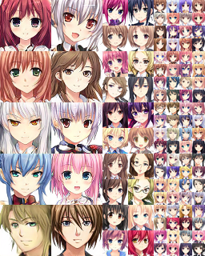
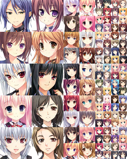
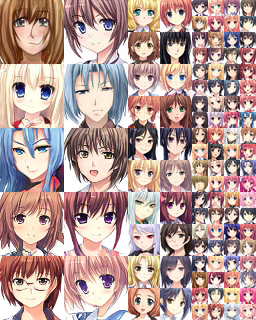

# Sprint 2

## Métriques

Pour évaluer le modèle, nous avons décidé de le noter sur deux critères : 
* La ressemblance des images générées par rapport à toutes celles du dataset d'entraînement, mesurée par le SSIM (index de similarité entre deux images)
* La capacité de sujets humains à déterminer quelles sont les images générées et celles provenant du dataset (qui ont été réalisées par des humains ou par CAO)   

Pour mesurer le premier critère, l’idée de base était d'entraîner un réseau de neurones pour qu’il détermine si oui ou non une image provenait du dataset. En raison des résultats peu convaincants (< 1% d’accuracy après 250 epochs et 8h d'entraînement), nous avons abandonné cette idée.

Finalement, nous avons pris un échantillon des images générées par le modèle, que nous avons comparé à l’ensemble du dataset.  Nous avons récolté les taux de ressemblances entre les images. Le seul inconvénient de cette méthode est le temps de calcul (~15 min par image) car il faut traverser le dataset entier.

Par exemple, pour l’image de gauche (qui a été générée), l’algorithme a trouvé les 4 images de droites (provenant du dataset) les plus ressemblantes. On constate effectivement quelques similarités comme la posture, le regard, la forme des yeux, les joues, etc. néanmoins, le SSIM le plus haut est de 33.65%.

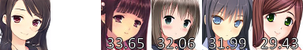

En moyenne pour l’image ci-dessus, la ressemblance avec le dataset est de 13.28%. Sur ce point, on peut donc estimer que le modèle “invente” réellement de nouveaux visages et qu’il ne s’agit pas de viles copies.
Les schémas ci-dessous présente les résultats obtenus sur notre échantillon (composé de 25 images), respectivement pour l’image la plus ressemblante, la seconde la plus ressemblante, etc. jusqu’à la quatrième :

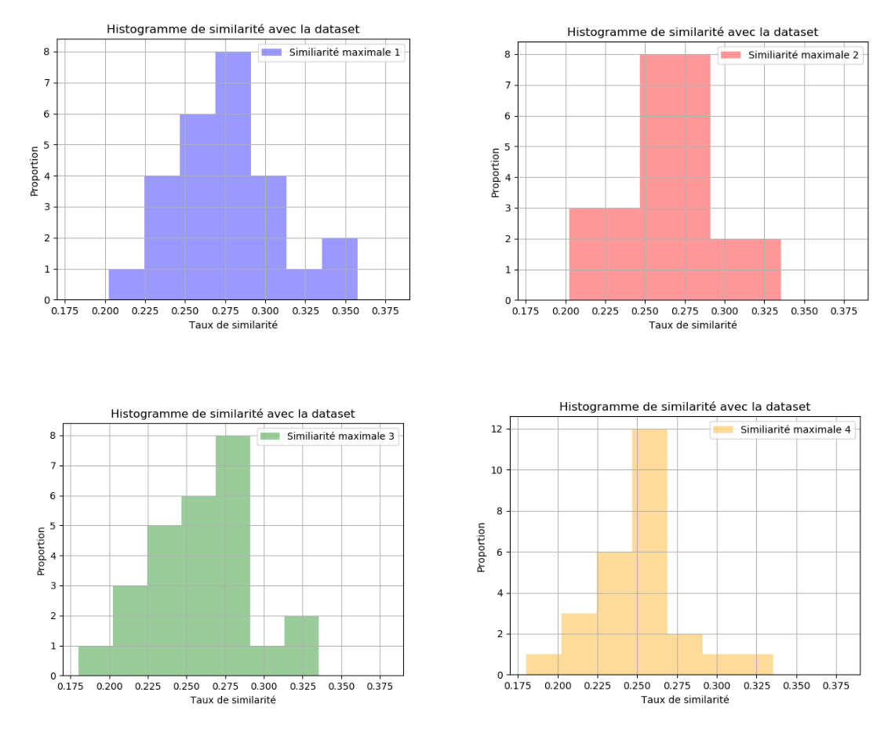

On constate finalement une répartition semblable à une courbe gaussienne, principalement centrée entre 0.25 et 0.30 de similarité. Viens ensuite une notion plus subjective de savoir à partir de quand on peut considérer qu’il s’agit d’une véritable création, néanmoins force est de constater qu’environ 70% des images générées sont originales.
Ci-dessous se trouve les courbes de similarités, ainsi que la courbe moyenne de similarité pour chaque image par rapport à l’ensemble du dataset (i.e. le SSIM entre une image générée et les 20 000 autres images du dataset) :

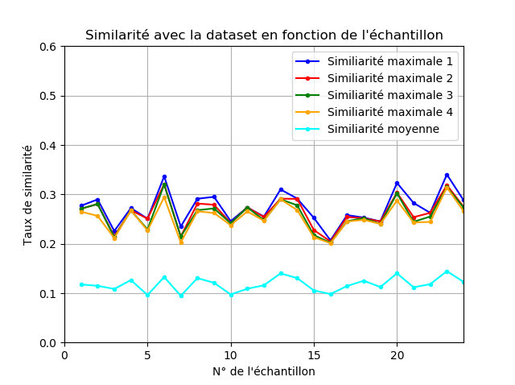

Nous avons ensuite demandé à 5 sujets humains (externes au projet) de déterminer sur un échantillon de 24 images lesquelles étaient générées et lesquelles provenaient du dataset.
Voici les résultats :

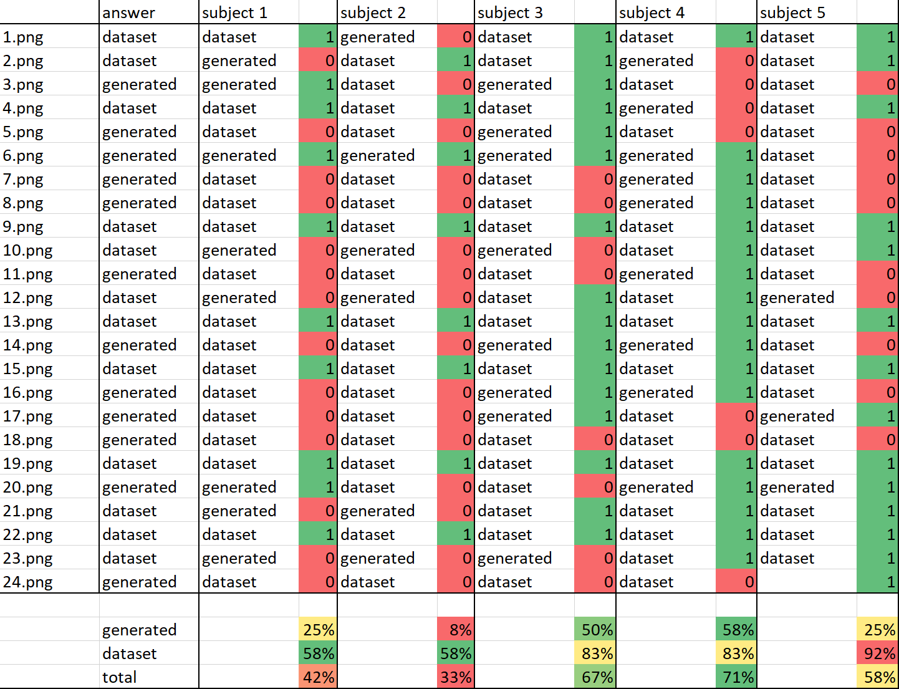

A partir des données recueillies, nous avons généré les matrices des confusion de chacun des sujets :

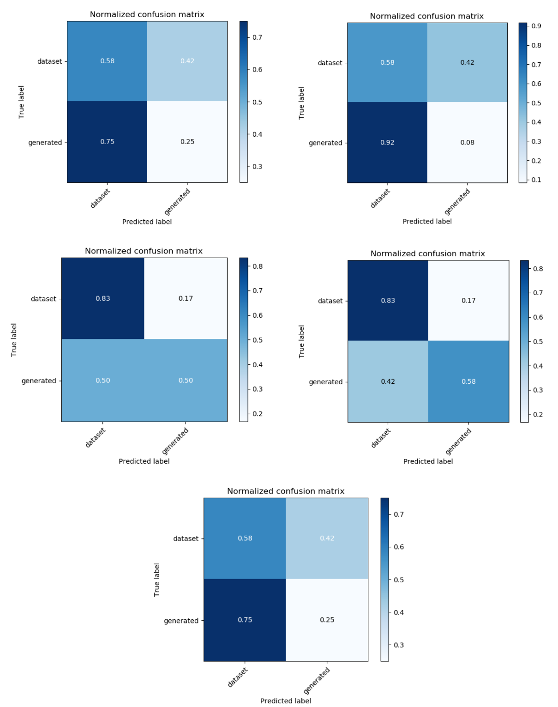

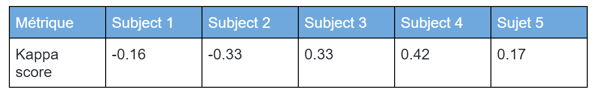
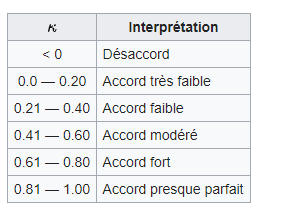

On observe que les sujets 1,2 et 5 sont incapables de distinguer les images générées des réelles dans le dataset. Le sujet 3 semble pouvoir détecter partiellement les images créés par le GAN. Le sujet 4 semble le plus constant dans la distinction, selon lui, les expressions sont le plus souvent ce qui trahit les générations (c’est d’ailleurs le sujet le plus novice en informatique).

Ce qui pousse les sujets à dire si une image est généré sont en premier lieux les déformations (souvent dues aux objets), l’absence d’attributs (nez, bouche, etc...) ainsi que le manque d’expression.

## Agrandissement des images
Les images 64x64 n’étant pas facilement observable, nous avons décidé de vouloir les agrandir afin d’obtenir une meilleure expérience pour l’utilisateur. Le problème est donc d’augmenter la taille des images sans entacher la qualité de celle-ci (par exemple qu’elles ne soient pas flou)

Pour cela, nous avons utilisé waifu2x, un modèle permettant l’agrandissement des images d’animes. Plusieurs types de modification sont possible, notamment en ajoutant du bruit et donc modifiant l’image original. Nous l’avons utilisé uniquement pour l’agrandissement.
Voici quelques exemples:

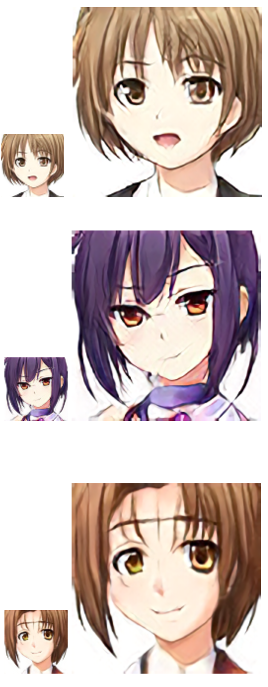

Et pour finir, voici une comparaison agrandissement via les outils classique (e.g. paint, photoshop, etc.) et via waifu2x:

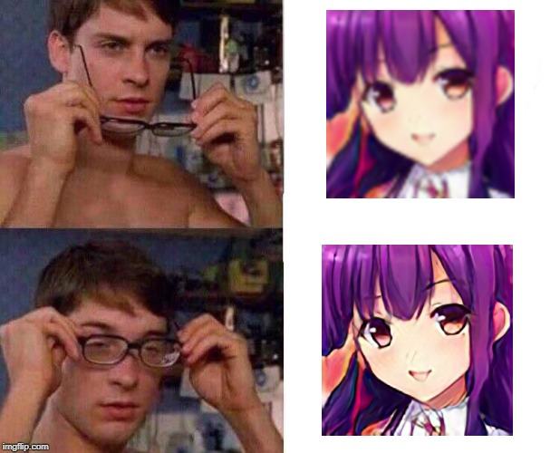

## Visualisation
Un des objectifs de ce sprint était de réaliser la visualisation inter-couche du modèle afin de d’observer en fonction du bruit fourni en entrée.

Pour cela nous avions plusieurs pistes:

La première était d'utiliser l’API fourni par Nvidia pour accéder aux différentes couches, le problème étant que celle-ci est limitée, elle ne permettait que d'accéder aux grandes parties du réseaux (mapping & générateur), il nous été donc impossible de récupérer les couches intermédiaires. 

La seconde approche était de convertir le modèle Nvidia en un modèle tensorflow, puis de convertir ce même modèle en tensorflowJS. Pour cela nous avons récupéré le graph afin de le sauvegarder. La conversion vers tensorflowJS n’a pas pu être réalisée en raison des différences importantes de versions et d’opérations non supportées par la version JS. De plus le modèle stocké dans le graphe était inutilisable avec tensorflow uniquement.

La dernière approche était de convertir le code Nvidia afin d’insérer des couches de sorties entre chaque couches convolutionnels, malheureusement cela nécessiterait de recommencer l'entraînement afin de recréer le modèle Nvidia, ce qui n’a pas été possible par un manque de temps mais aussi pour une question de financement.
De toute manière, pour utiliser l’API Nvidia, il faut obligatoirement une machine avec un GPU. Cela aurait été trop coûteux et fastidieux de déployer un backend.
