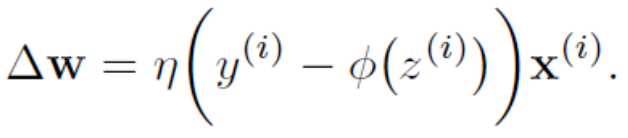

## Introduction

#### Historique
1943. Apparition du neurone artificiel (McCullock & Pitts).
1957. Perceptron (Rosenblatt)

#### Pourquoi ?
* Environnements inconnus
* Agent qui s'améliore avec l'expérience

#### Applications
* Classification
* Régression/prédiction
* Clustering d'éléments similaires
* Renforcement
* Réduction de dimensionnalité 

#### Learning element 
* Elément de performance (agent logique, basé sur l'utilité, exploration, ...)
* Composant fonctionnel (fonction d'évaluation, de perception/action, de transitions, ...)
* Représentation (fonction linéaire avec poids, axiomes, réseau neuronal, ...)
* Feedback (victoire/défaite, résultat, ...)

#### Types d'apprentissage
* **Supervisé** : Exemples d'entrées et sorties disponible, l'objectif est d'obtenir une fonction qui associe l'un à l'autre
* **Semi-supervisé** : Les données d'apprentissage n'ont pas toujours une étiquette
* **Non-supervisé** : Extraction des patterns dans les entrées sans direction spécifique sans aucun feedback. Les résultats sont à interpréter.
* **Renforcement** : Apprend en fonction des récompenses/punitions suite à ses actions.

#### Représentation des données
Séquence de valeurs réelles/entères, matrices, vecteurs one-hot, bag-of-words ou tf-idf, ...

#### Flow typique du ML
1. **Preprocessing du dataset** : Feature extraction/scaling/selection, réduction de dimensionnalité, échantillonage, ...
2. **Apprentissage** : Sélection du modèle, cross-validation, ...
3. **Evaluation** : Métriques, optimisation des hyper-paramètres, ...
4. **Prédiction**

## Vocabulaire et concepts

##### Epoch
Un passage complet sur l'ensemble de données.

##### Batch
Un sous-ensemble des données d'entraînement lorsque celui-ci est trop volumineux pour être utilisé entièrement à chaque fois.

Dans ce cas, on ajoute la notion d'*itération* qui est le nombre de batches nécessaire pour compléter une epoch

##### Feature scaling 
Normalise les données suivant une échelle (min-max, z-score, ...) pour éviter les problèmes avec les modèles qui utilisent la notion de distance

##### Data imbalance 
Phénomène qui se produit lorsque la proportion d'exemples de chaque classe est très différente, ce qui tend à favoriser les classes avec un grand nombre d'échantillons

##### Sous-apprentissage et sur-apprentissage

##### Compromis biais-variance
Un haut biais permet un apprentissage généralement plus rapide et simple, mais procure de moins bonne performances sur les problèmes complexes (e.g. logistic regression, linear regression, ...).

Une haute variance permet d'impacter l'estimation de la fonction cible est d'être plus réceptif aux particularités des données, ce qui est désirable mais dans une certaine mesure afin d'éviter l'overfitting (e.g. arbres de décisions, knn, svm, ...).

C'est donc un compromis à faire. On peut utiliser par exemple la régularisation L2 (qui introduit un nouveau biais qui pénaliser les valeurs extrêmes de poids, à condition d'avoir fait du feature scaling).

##### Paramétrique et non-paramètrique
**Paramétrique** :
Estimation des paramètres à partir des données d'entraînement. Le nombre de paramètres est indépendant du nombre de données (e.g. perceptron, SVM linéaire, logistic regression, ...).

L'avantage des modèles paramètriques est qu'ils sont généralement plus simple, l'apprentissage est rapide. ?éanmoins ils sont souvent limités aux problèmes simples.

**Non-paramétrique** :
Le nombre de paramètres augmente avec la taille des données (e.g. DT, SVM, KNN, ...).

L'avantage des ces modèles est qu'ils sont généralement plus flexibles et puissant, mais ils sont plus lent à entrainer et nécessite plus de données d'entrainement. Le risque de sur-apprentissage est également plus élevé.

Généralement les méthodes non-paramétriques sont utiles lorsque l'on a beaucoup de données et aucune connaissance au préalable, et qu'on veut éviter de choisir les features.

## Classification simple

### Perceptron

Le perceptron apprend les poids optimaux à multiplier avec les entrées pour déterminer si le neurone s'active ou non. La fonction d'activation est celle de Heaviside (+1 si positif, -1 si négatif). Il s'agit donc d'un outil de classification binaire.

A noter que w0x0 = ϑ est appelé le biais.

Le principe est le suivant : 
1. Les poids sont initalisés à ≈ 0
2. Pour chaque exemple d'entraînement x(i) :
  1. On calcule la sortie estimée y(i)
  2. On met à jour les poids wj += Δ wj

*η* est un nombre entre 0 et 1 qui constitue le learning rate.

A noter que Δ wj est nul si la prédiction est correcte, donc le poids ne changera pas.

#### Remarques
Si le dataset n'est pas séparable linéairement, le perceptron bouclera à l'infini.

Il est possible d'étendre le perceptron pour faire de la classification multi-classe par du *One-vs-All*, qui consiste à créer un classeur spécialisé dans la détection d'une classe en particulier, puis de déterminer quel classeur est actif pour tel entrée.

### Adaptive linear neurons (Adaline)

Sur le même principe que le perceptron, toutefois la fonction d'activation est linéraire, ce qui permet d'avoir des sorties continues plutôt que binaire. On rajoute parfois un *quantizer* pour la prédiction de classe.

On charche à optimiser la fonction de coûts *Sum of Squared Errors* (SSE) entre les sorties et les vraies classes :

On utilise pour cela l'algorithme du gradient, notamment parce que J(w) est convexe mais aussi parce que c'est très rapide.

Toutefois, on utilise généralement la *descente de gradient stochastique* (SGD) pour éviter l'utilisation du dataset complet et accélerer le temps de calcul. Dans ce cas, il faut veiller à mélanger le dataset pour obtenir des résultats satisfaisants. Un learning rate adaptatif est particulièrement adapté avec le SGD. 

#### Remarques
La mise à jour des poids se fait sur le dataset en entier, à l'inverse du perceptron où elle se fait exemple par exemple.

Le feature scaling permet d'accélerer la descente du gradient.

Une valeur de learning rate *η* forte peut empêcher de converger (si le pas du gradient est trop élevé) tandis qu'une valeur faible augmentera considérablement le temps de calcul.

## Classification

### Logistic regression

La fonction d'activation est une sigmoïde (fonction logistique). Elle se base sur le principe du rapport des chances (odds ratio), c'est-à-dire qu'une échantillon appartienne à une certaine classe étant donné ses attributs.

La fonction de coûts est modifiée pour utilisée les logarithmes (Log-likelyhood) afin d'éviter les underflow, en plus de trasformer les produits en somme, ce qui en soit les calculs plus faciles.

#### Remarques
La logistic regression est plus sensible aux outliers. Il s'agit également d'un modèle simple qui est facile à mettre en place et à jour.

### Support vector machine (SVM)

Le principe est de maximiser les marges (distance entre un hyperplan et les échantillons les plus proches de ce plan, a.k.a support vectors) entre les classes, dans le but d'éviter l'overfitting et permettre une meilleure généralisation.

Un avantage du SVM est de pouvoir faire de la kernalisation. Il s'agit d'utiliser un noyau qui exploite des combinaisons non-linéaires et des attrinuts originaux en les projetant dans un espace à plus haute dimension, dans laquelle ils deviennent potentiellement séparables (e.g. radial basis function kernel).

#### Remarques
Les SVMs se concentrent principalement sur les échantillons à la frontière des classes. En pratique, les résultats sont similaires ) la logistic regression.

Si on utilise un kernel, il est nécessaire d'entraîner le SVM dans la dimension supérieure (logique) : il faut donc transformer toutes les entrées auparavant.

Le *gamma* du RBF kernel détermine l'influence des échantillons.

### Arbres de décision

Le principe est d'exploiter les attributs de l'ensemble de données pour apprendre une série de "questions" pour inférer les classes. Chaque noeud sépare les données qui permettent d'obtenir le plus grand gain d'information, et ce processus est répété jusqu'à ce que les feuilles soient *pures* (i.e. ne représentent qu'une seule classe).

On teste sur le dataset du parent *Dp* la séparation selon l'attribut *f*, en fonction de l'impureté *I* et du nombre d'échantillons *N* du parent et des enfants :

L'impureté (qu'on cherche à réduire), est calculée selon l'entropie (elle-même calculée sur la proportion d'échantillons appartenant à une certaine classe pour un certain noeud). C'est-à-dire qu'elle sera nul si tous les échantillons sont dans la même classe et maximale si tous les échantillons sont différents.

L'indice gini peut aussi être utilisé pour le calcul de l'impureté. Celui-ci est similaire à l'entropie mais se base sur la probabilité d'erreur de classification.

#### Remarques
Généralement, on fait une séparation binaire pour gagner en temps de calcul.

### Random forest
Il s'agit d'un ensemble d'arbres de décisions (estimators), dont la classification se fait au vote majoritaire sur les k arbres.

Les performances sont généralement meilleures qu'avec un seul arbre.

### K-nearest neighbors (KNN)

Le principe est de se dire que les éléments proches les uns par rapport aux autres sont probablement de la même classe.

L'algorithme est le suivant :
1. Choisis un nombre de voisins *k* et une mesure de distance
2. Trouver les *k* voisins les plus proches à classer
3. Vote à la majorité (pondérée ou non)

On utilise généralement une distance de minkowski.  

Un inconvénient majeur de cette méthode est que l'ensemble des exemples d'entrainement doit être gardé en mémoire, et par conséquent les knn sont peu performants pour une dimensionnalité élevée.

## Ensemble learning

On part du principe qu'un ensemble de classeur plus faibles performent mieux qu'un seul très bon classeur.

A partir d'un ensemble d'entraînement, un certain nombre de classeurs sont produits (ceux-ci peuvent potentiellement être différents algorithmes ou sous-ensemble d'entraînement).

### Bagging (bootstrap aggregation)

Le principe est d'utiliser différents sous-ensemble d'apprentissage (bootstrap) aléatoire avec remise.

Chaque bootstrap est utilisé pour entraîner un classeur.

Cela permet de réduire la variance, mais pas le biais. C'est pour cette raison qu'on utilise généralement des classeurs avec un biais faible (e.g. decision trees).

### Boosting
Le principe est de se focaliser sur les exemples difficiles à classer.

L'algorithme est le suivant :
1. Tirer un sous-ensemble du dataset pour entrainer un premier classeur
2. Tirer un autre sous-ensemble du dataset et y rajouter 50% des exemples mal classés par le classeur précédent pour entrainer le suivant
3. Répéter l'opération autant de fois que l'on veut
4. Faire un vote majoritaire

Théoriquement, cela permet de réduire à la fois le biais et la variance contrairement au bagging. Toutefois, la variance est souvent élevée dans les algorithmes de boosting.

#### Adaboost
Il s'agit d'un modèle de boosting qui utilise le dataset complet et dont les échantillons sont pondérés à chaque étape. Cela permet de construire un classeur qui apprend des erreurs passées.

Exemple : 
1. Maximisation de la fonction de coûts
2. Ajustement des poids, et entrainement d'un second classeur
3. Ajustement des poids, et entrainement d'un troisième classeur
4. Vote majoritaire